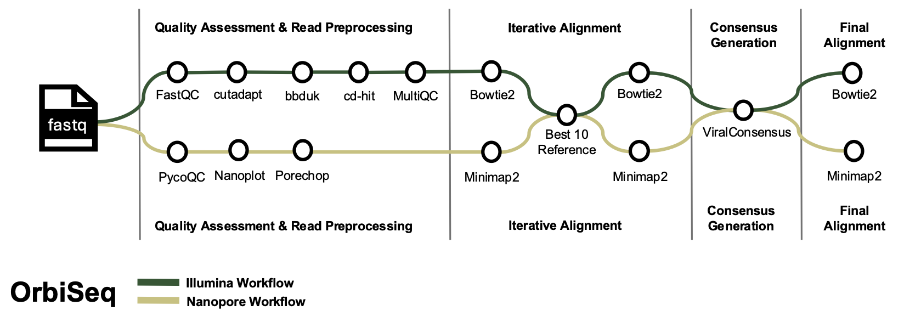

# 

[](https://www.nextflow.io/)
[](https://docs.conda.io/en/latest/)
[](https://sylabs.io/docs/)

# OrbiSeq
OrbiSeq is a Nextflow pipeline to analyze short and long sequences for *Orbiviruses*.

## Contents
- [Pipeline Overview](#Pipeline-Overview)
	- [Platform](#Platform)
- [Input Files](#Input-Files)
	- [Data](#Data)
	- [Reference](#Reference)
- [Output Files](#Output-Files)
- [Workflow Steps](#Workflow-Steps)
- [Running the Pipeline](#Running-the-Pipeline)
	- [Optional Deduplication](#Optional-Deduplication)
- [Testing](#Testing)
- [Stopping and Resuming](#Stopping-and-Resuming)
- [Dependencies](#Dependencies)
- [Citation](#Citation)


## Pipeline Overview
OrbiSeq is a nextflow pipeline that will perform alignment and creates a consensus sequence from Illumina or Nanopore sequence data for any *Orbivirus* with 10 segments or any segmented virus with 10 or fewer segments.

OrbiSeq performs three rounds of alignment. The first aligns reads to a large set of representative reference sequences (this is especially important when working with unknown samples or serotypes).
Following this, the reference sequence with the highest number of aligned reads for each segment is selected to generate a “best10 reference.” Reads are then mapped to these best10 reference sequences to construct a consensus sequence.
A final alignment is performed against the consensus sequence itself, providing validation and allowing for manual inspection.

NOTE: This pipeline assumes singly infected samples and does not consider the possibility that samples may correspond to coinfections. 
The pipeline will only produce a single consensus sequence for each segment, based on the existing reference sequence to which the most reads align. 
It is recommended to inspect initial alignments for indication of co-infection, which could manifest as reads mapping to multiple, genotypically distinct, reference sequences.


### Platform:
This pipeline has the capability to run either Illumina or Nanopore sequencing data. When running this pipeline the user must specify which platform their data came from by using the --platform parameter. 


## Input Files

### Data:
- Users will direct the pipeline where fastq files are located by using the --fastq_dir parameter. Illumina and Nanopore data should not be run through the pipeline at the same time. 
	- Illumina: 
		- Paired-end (R1 and R2) or single-end reads.
		- The pipeline generates consensus sequences using the following thresholds: minimum quality score of 30, depth of 5, and frequency of 0.25. Users can modify these settings in the illumina.config file. 	
	- Nanopore: 
		- Users must concatenate raw read files into a single fastq.gz file (one file per barcode). This can be done using the cat command. 
		- Users have the option to include a sequence summary file, which should be placed in the ./summary directory and begin with {sequencing_summary_}*.txt. 
		- The pipeline generates consensus sequences using the following thresholds: minimum quality score of 10, depth of 5, and frequency of 0.25. Users can modify these settings in the nanopore.config file. 	 
		
		
### Reference:

This pipeline can utilize any reference genome from *Orbiviruses* with 10 segments or any segmented genome with 10 or fewer segments. The user must specify which reference file to use by using the parameter --reference. 
- Premade Reference Sequences 
	- There are premade reference files for bluetongue virus (BTV), epizootic hemorrhagic disease virus (EHDV), and African horse sickness virus (AHSV). More information on the creation of these references can be found in [cite publication]. 
		- The reference files can be found in ./reference/ directories. 
		- * Note: the provided references will not be updated, therefore we recommend that users update the database to current sequences as this tool could be used years from this point.
		- Incomplete sequences may arise with the use of the premade referece. We recommend inspecting the best10 reference and alignment as this could be a result of an incomplete reference sequence.  
- User Included Reference Sequences	
	- The user is also able to upload their own custom reference file. 
	- When uploading custom reference sequences the user must ensure that the file is formatted correctly. It should be formatted as: segment#_sample_id (ex. s1_Genbank_Acession). Additionally there should be NO BLANK LINES throughout the document. 

## Output files

The pipeline outputs the best reference, alignments, and consensus sequence files. By default the pipeline outputs files to the results folder unless specified. Users can change the output location using the --outdir parameter. 

Within the chosen output directory, files will be organized into subfolders named after the tool used as described below: 
	
- Illumina 
	- Quality Assessment: 
		- FastQC - *_fastqc.html in ./outdir/quality_assessment_illumina
		- MultiQC - *_multiqc_report.html in ./outdir/quality_assessment_illumina 
	- Preprocessed Reads: 
		- trimmed, deduplicated fastq files - in ./outdir/illumina_preprocessing/trimmed_deduplicated_fastq|trimmed_fastq
	- Initial alignment: 
		- {sample_id}.existing_refseq.bam in ./outdir/initial_alignment_illumina
	- Best10 Reference & best10 alignment: 
		- {sample.id}_best10_refseq.fa in ./outdir/best10_illumina 
		- *_best10_alignment.bam in ./outdir/best10_illumina
	- Consensus sequence & consensus alignment: 
		- {sample_id}.viral_consensus.fasta in ./outdir/final_consensus_illumina
		- {sample_id}.viral_consensus.bam in ./outdir/final_consensus_illumina
			
- Nanopore 
	- Quality Assessment: 
		- PycoQC - summary.html in ./outdir/quality_assessment_nanopore
		- Nanoplot - NanoPlot-report.html in ./outdir/quality_assessment_nanopore
	- Preprocessed Reads: 
		- Porechop - *.fastq.gz in ./outdir.quality_assessment_nanopore
	- Initial alignment: 
		- {sample_id}.existing_refseq.bam in ./outdir/initial_alignment_nanopore
	- Best10 Reference & best10 alignment: 
		- {sample.id}_best10_refseq.fa in ./outdir/best10_nanopore 
		- *_best10_alignment.bam in ./outdir/best10_nanopore
	- Consensus sequence & consensus alignment: 
		- {sample_id}_viral_consensus.fasta in ./outdir/final_consensus_nanopore
		- {sample_id}_viral_consensus.bam in ./outdir/final_consensus_nanopore
		
		
## Workflow Steps

### Illumina workflow 
- Preprocessing and quality assessment of input reads : Stenglein Lab read_preprocessing pipeline
	- Optional collapse duplicate reads 
- Align input reads to large Orbi RefSeq : bowtie2 build & align 
- Choose best 10 segments from initial alignment
- Align input reads to best10 RefSeq : bowtie2 build & align 
- Call variants & create consensus sequences: ViralConsensus
- Align input reads to final consensus sequence : bowtie2 build & align 

### Nanopore workflow 
- Quality assessment of input reads and sequencing run : Nanoplot & PycoQC
- Preprocessing of input reads: Porechop
- Align input reads to large Orbi RefSeq : minimap2 align 
- Choose best 10 segments from initial alignment
- Align input reads to best10 RefSeq : minimap2 align 
- Generate consensus sequences: ViralConsensus
- Align input reads to final consensus sequence : minimap2 align
	
These workflows take advantage of nf-core [modules](https://nf-co.re/modules) for many of these components and the overall [nf-core](https://nf-co.re/) design philosophy.

The Illumina workflow takes advantage of the [Stenglein Lab Read Preprocessing Pipeline](https://github.com/stenglein-lab/read_preprocessing).

The Nanopore workflow takes advantage of the [Nanoplot](https://github.com/wdecoster/NanoPlot) tool.

Both workflows take advantage of the [ViralConsensus](https://github.com/niemasd/ViralConsensus) tool. 


## Running the Pipeline

1. Clone the pipeline from github and move into the directory
```
git clone https://github.com/tdunham19/OrbiSeq.git
cd OrbiSeq
```

2. Test the pipeline to ensure that it is working correctly: [Testing](#Testing)

3. Run the pipeline: The user MUST specify sequencing platform, which reference file to use, and where the input fastq files are located. The user has the option to specify the output directory. 
```
nextflow run main.nf --platform ['illumina' or 'nanopore'] --fastq_dir /path/to/fastq/directory --reference /path/to/{reference_file}.fasta --outdir /optional/path/to/output/directory --profile ['singularity' or 'conda'] -resume
```


### Optional Deduplication (Illumina only)

```
nextflow run main.nf --platform illumina --fastq_dir /path/to/fastq/directory --reference /path/to/{reference_file}.fasta --outdir /optional/path/to/output/directory --profile ['singularity' or 'conda'] --collapse_duplicate_reads -resume
```


## Testing

To test if the pipeline is working properly the pipeline is provided with small test fastq files. 

The testing is successful if the pipeline completes all steps with no errors (Note - PycoQC will not run for the Nanopore test).

Before testing, set a supported version of Nextflow (between v23.10.1 and v25.04.8):
```
export NXF_VER=25.04.8
```

To test the illumina workflow: 
```
nextflow run main.nf \
  --platform illumina \
  -profile ['singularity' or 'conda'],test_illumina \
  -resume
```

To test the nanopore workflow: 
```
nextflow run main.nf \
  --platform nanopore \
  -profile ['singularity' or 'conda'],test_nanopore \
  -resume
```


## Stopping and Resuming 
- To stop the run
```
control(^) C
```
- To resume the run add the -resume option
```
nextflow run main.nf --platform --fastq_dir --reference --profile -resume
```


## Dependencies
To run the pipeline the user will need to be working on a computer that has nextflow and singularity installed.

This pipeline requires nextflow version >= 23.10.1-25.04.8 [Installation - Nextflow Documentation](https://www.nextflow.io/docs/latest/install.html). 
It is recommended to install nextflow in a conda environment and set a supported version within the specified range (see the test commands for an example). 

There is no specified version of Singularity for this pipeline. The pipeline has been tested with singularity-ce v3.9.9-bionic.

The user has the option to also use a conda profile, this pipeline requires conda version >= 25.3.1. 


## Citation
If you use this tool please consider citing our publication: "Optimized library preparation, sequencing, and data analysis protocols for the generation of orbivirus consensus sequences" DOI: 10.1186/s12864-025-12422-y
